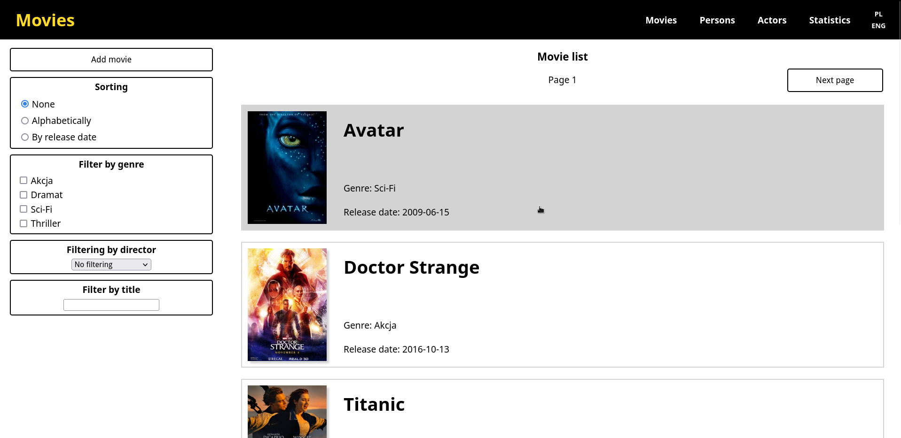
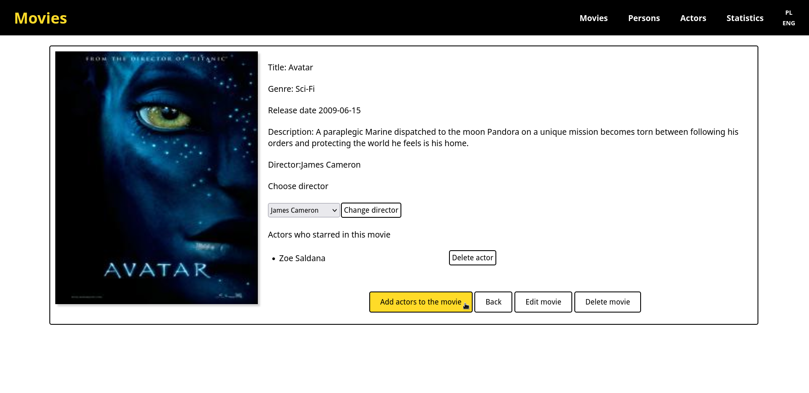
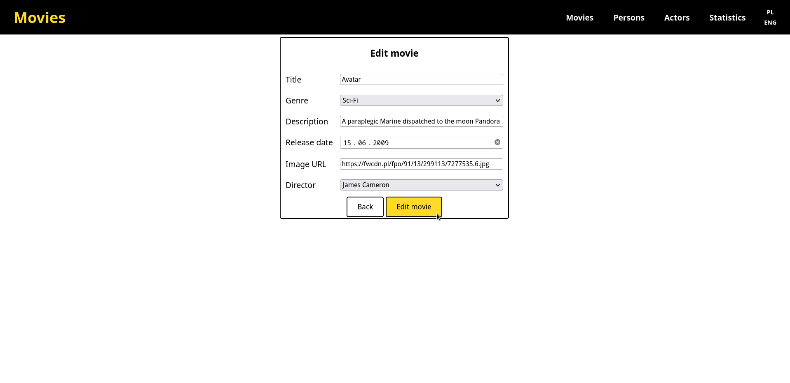
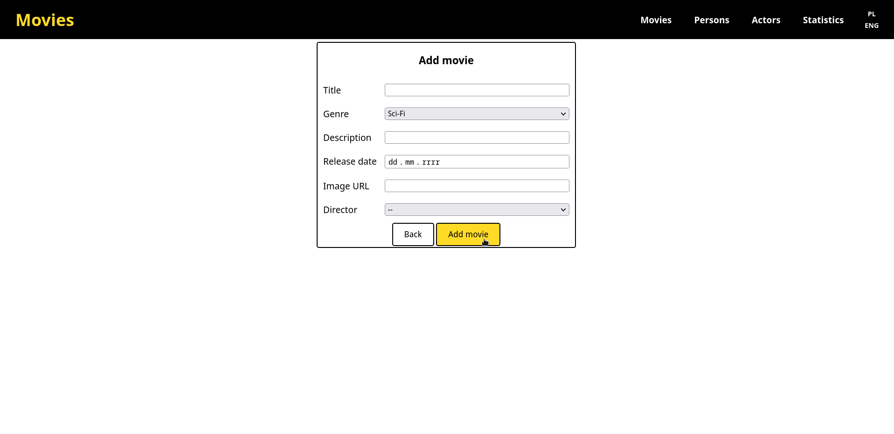
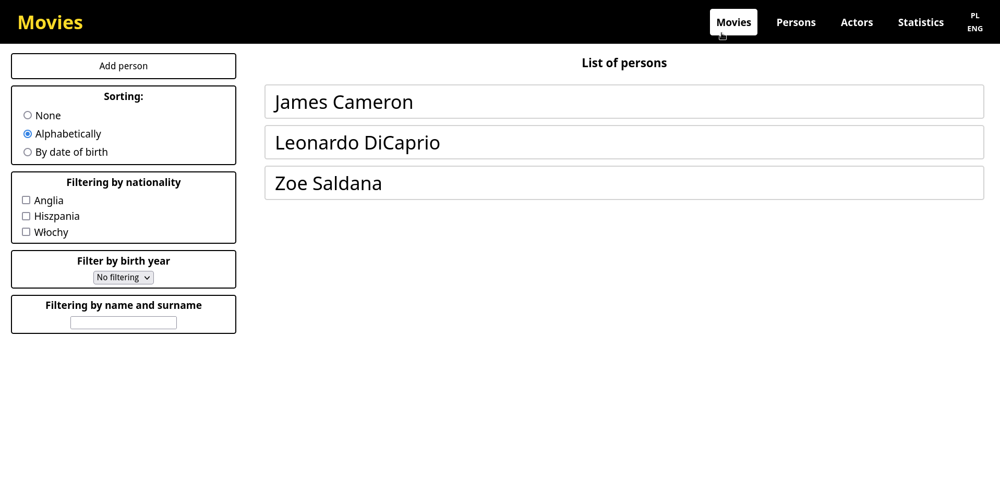
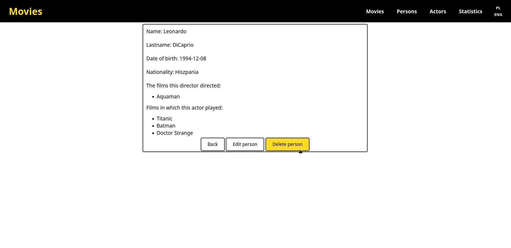
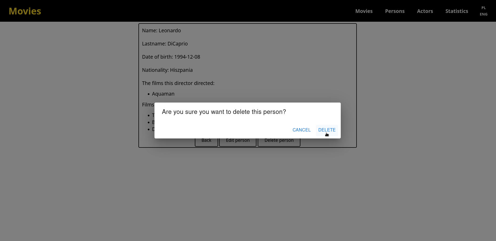
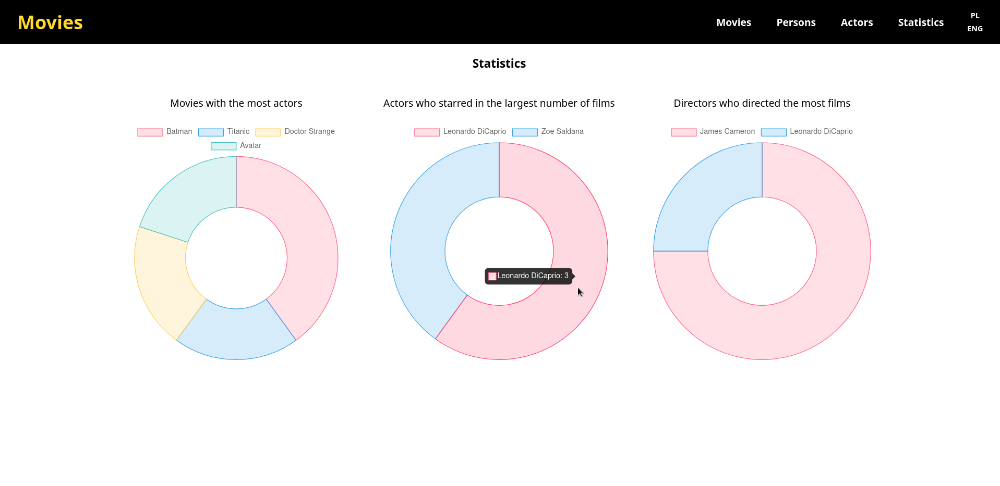

## Frontend Development Project

Website project that allows you to add, edit, delete actors, movies, directors. Website created with React, Redux, JavaScript, CSS, SCSS, Express, Postgres. The project was made for a Frontend Development course at the University of Gdańsk. The frontend part was made entirely by me, the backend part was provided by the class instructor.

## Project Status

Project completed 18 January 2022.

## Project Screen Shots

## Technologies Used

-   cors
-   chart.js
-   dotenv
-   express
-   formik
-   fs
-   i18next
-   i18next-http-backend
-   lodash
-   mui
-   material-ui-confirm
-   nodemon
-   normalizr
-   pg
-   prettier
-   react
-   react-chartjs-2
-   react-dom
-   react-i18next
-   react-redux
-   react-router-dom
-   react-scripts
-   redux-api-middleware
-   redux-logger
-   redux-thunk
-   sass
-   uuid
-   yup

## Installation and Setup Instructions

Before starting the project, you must start the Postgres database. You can run it using Docker. You need to install Docker, then use the command to start the Postgres container.

`docker run --name postgres -e POSTGRES_PASSWORD=tajne -dp 5432:5432 postgres`

Clone down this repository. You will need `node` and `npm`/`yarn` installed globally on your machine.

Installation:

`npm install` or `yarn install`

To Start Server and App:

`npm start` or `yarn start`

To Visit App:

`localhost:3000/`

## Functionalities

-   The application is responsive (supports phone, tablet and normal computer view).
-   It has two languages versions (Polish and English) that can be switched with the click of a button. It saves the last selected language version.
-   It has the possibility to display all movies and people (directors and actors), the number of records is divided by pagination
-   Both lists can be filtered by 3 different types of fields, and sorting is available.
-   It is possible to add records, all records are validated.
-   Records can be edited and directors/actors assigned in the master-details view
-   All records are available in a master-detail view
-   3 types of statistics are available, which can be viewed in the statistics tab
